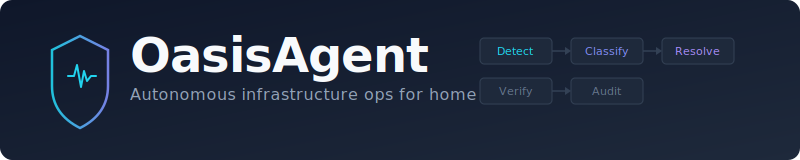

<p align="center">
  
</p>

<p align="center">
  <a href="https://github.com/dadcoachengineer/oasisagent/actions"></a>
  <a href="https://github.com/dadcoachengineer/oasisagent/pkgs/container/oasisagent"></a>
  <a href="LICENSE"></a>
  <a href="https://github.com/dadcoachengineer/oasisagent/issues"></a>
</p>

<p align="center">
  Detects failures. Classifies with tiered LLM reasoning. Auto-remediates or escalates with full context.
</p>

---

OasisAgent bridges the gap between **monitoring** (you know something broke) and **resolution** (it's fixed). It sits alongside your existing stack — not inside it — and closes that gap automatically for known issues, and with intelligent diagnosis for novel ones.

## Three-Tier Reasoning

| Tier | What it does | Latency | Cost |
|------|-------------|---------|------|
| **T0 — Known Fixes** | Pattern match against a YAML registry. No LLM. | <1ms | Free |
| **T1 — Triage** | Local SLM classifies events, filters noise, packages context. | 100-500ms | Your hardware |
| **T2 — Diagnosis** | Cloud reasoning model diagnoses novel failures, recommends actions. | 5-45s | Per-token |

T0 handles the common cases instantly. T1 runs on your own hardware (Ollama, LM Studio, vLLM). T2 is invoked only when needed — Claude, GPT, Gemini, or any OpenAI-compatible endpoint via [LiteLLM](https://github.com/BerriAI/litellm).

## Safety Guardrails

All enforced in deterministic code — never in LLM prompts.

- **Risk tiers**: `AUTO_FIX` | `RECOMMEND` | `ESCALATE` | `BLOCK`
- **Blocked domains**: Security systems (locks, alarms, cameras) permanently excluded
- **Circuit breaker**: Max 3 attempts per entity per hour, global kill switch at 30% failure rate
- **Dry-run mode**: Log every decision without executing anything
- **Approval queue**: `RECOMMEND` actions require operator approval via MQTT before execution

## Quick Start

### Docker Compose (simplest)

```bash
git clone https://github.com/dadcoachengineer/oasisagent.git
cd oasisagent

cp config.example.yaml config.yaml
cp .env.example .env
# Edit config.yaml and .env with your endpoints and tokens

docker compose up -d
docker compose logs -f oasisagent
```

### Docker Swarm / Portainer

The image ships with a baked-in default config. Pass everything as environment variables — no config file mounting needed.

```bash
docker service create \
  --name oasisagent \
  --env HA_URL=http://your-ha:8123 \
  --env HA_TOKEN=your-token \
  --env MQTT_BROKER=mqtt://your-broker:1883 \
  --env MQTT_PASS=your-password \
  --env REASONING_LLM_API_KEY=your-key \
  ghcr.io/dadcoachengineer/oasisagent:latest
```

Or use the `docker-stack.yml` for a full Swarm stack with secrets support.

> See [Deployment Guide](#deployment-options) below for all options.

### Prerequisites

| Service | Required | Notes |
|---------|----------|-------|
| Home Assistant | Yes | Long-lived access token required |
| MQTT broker | Yes | EMQX, Mosquitto, or any standard broker |
| InfluxDB v2 | Recommended | Audit trail storage |
| Local LLM (Ollama) | Recommended | T1 triage — or use a cloud endpoint |
| Cloud LLM API key | Optional | T2 reasoning — Claude, GPT, Gemini, OpenRouter |

## Supported Systems

| System | Status | Capabilities |
|--------|--------|-------------|
| Home Assistant | **Live** | State monitoring, automation errors, log analysis, integration restarts, service calls |
| Docker | Phase 2 | Container health, restart, stats, log collection, OOM/crash detection |
| Proxmox | Phase 3 | VM/CT management, node monitoring |

Adding a new system = implement the [handler interface](ARCHITECTURE.md). No core changes needed.

## Ingestion Sources

Multiple adapters produce the same canonical event model:

- **MQTT** — Subscribe to topics on any broker (zigbee2mqtt, frigate, custom sensors)
- **HA WebSocket** — Real-time state changes, automation failures, service call errors
- **HA Log Poller** — WebSocket `system_log/list` with pattern matching against structured entries
- **More planned** — Docker events, Proxmox tasks, webhook receiver, InfluxDB alerts

## Configuration

All config in `config.yaml`, secrets via environment variables with `${VAR}` syntax. See [`config.example.yaml`](config.example.yaml) for a fully documented reference.

```yaml
llm:
  triage:
    base_url: http://your-ollama:11434/v1    # Any OpenAI-compatible endpoint
    model: qwen2.5:7b
  reasoning:
    base_url: https://openrouter.ai/api/v1   # Or api.anthropic.com, api.openai.com, etc.
    model: openrouter/anthropic/claude-sonnet-4-5
    api_key: ${REASONING_LLM_API_KEY}
```

<details>
<summary><strong>Config sections reference</strong></summary>

| Section | What it controls |
|---------|-----------------|
| `agent` | Event queue size, correlation window, metrics port, dry-run mode |
| `ingestion` | Event sources — MQTT topics, HA WebSocket subscriptions, log poller patterns |
| `llm` | T1 and T2 endpoints, models, timeouts, token limits |
| `handlers` | Managed system connections (HA URL/token, Docker socket) |
| `guardrails` | Risk tiers, blocked domains, circuit breaker thresholds |
| `audit` | InfluxDB connection for the full audit trail |
| `notifications` | Alert channels — MQTT, email (SMTP), webhook |
| `known_fixes` | Path to YAML fix registry files |

</details>

## Deployment Options

### Option 1: Docker Compose

Best for single-node setups. Mount `config.yaml` and pass secrets via `.env`.

```bash
docker compose up -d
```

### Option 2: Docker Swarm / Portainer

Best for multi-node clusters. Config is baked into the image — configure entirely via environment variables.

Set these env vars in Portainer's stack editor or your shell:

| Variable | Required | Default |
|----------|----------|---------|
| `HA_URL` | Yes | `http://localhost:8123` |
| `HA_TOKEN` | Yes | — |
| `MQTT_BROKER` | Yes | `mqtt://localhost:1883` |
| `MQTT_PASS` | Yes | — |
| `REASONING_LLM_API_KEY` | For T2 | — |
| `TRIAGE_LLM_BASE_URL` | No | `http://localhost:11434/v1` |
| `TRIAGE_LLM_MODEL` | No | `qwen2.5:7b` |
| `INFLUXDB_TOKEN` | For audit | — |
| `INFLUX_URL` | For audit | `http://localhost:8086` |
| `DRY_RUN` | No | `true` |

### Option 3: From Source

```bash
git clone https://github.com/dadcoachengineer/oasisagent.git
cd oasisagent
pip install -e ".[dev]"
cp config.example.yaml config.yaml
# Edit config.yaml
oasisagent
```

## Observability

- **InfluxDB audit trail** — Every event, decision, action, and verification recorded
- **Grafana dashboards** — Import [`dashboards/oasisagent-overview.json`](dashboards/) for event volume, decision distribution, and action results
- **Prometheus metrics** — `/metrics` endpoint for real-time alerting (events processed, queue depth, processing latency, LLM call duration)

## Known Fixes Registry

The `known_fixes/` directory contains YAML files that power the T0 tier — instant, zero-cost resolution:

```yaml
fixes:
  - id: ha-deprecated-kelvin
    match:
      system: homeassistant
      event_type: automation_error
      payload_contains: "kelvin"
    diagnosis: "HA deprecated 'kelvin' in favor of 'color_temp_kelvin'"
    action:
      type: recommend
      handler: homeassistant
      operation: notify
```

Contributing known fixes is the easiest way to improve OasisAgent. If T1/T2 diagnosed a failure for you, add it to the registry so it resolves instantly next time.

## Contributing

Contributions welcome! The most impactful areas:

1. **Known fixes** — Add YAML entries for failure patterns you've encountered
2. **Ingestion adapters** — New event sources (Docker events, Proxmox, webhook receiver)
3. **Handlers** — Support for additional managed systems
4. **Notification channels** — ntfy, Pushover, Slack, Discord, etc.

```bash
# Development setup
git clone https://github.com/dadcoachengineer/oasisagent.git
cd oasisagent
pip install -e ".[dev]"

# Run tests
pytest

# Lint
ruff check .
```

Please [open an issue](https://github.com/dadcoachengineer/oasisagent/issues) before starting work on major features to discuss the approach.

## Architecture

See [ARCHITECTURE.md](ARCHITECTURE.md) for the full design specification — data models, component interfaces, configuration schema, and phasing details.

## Roadmap

| Phase | Version | Scope |
|-------|---------|-------|
| 1 | v0.1.x | Core framework — ingestion, decision engine, HA handler, known fixes, audit, circuit breaker |
| 2 | v0.2.x | T2 cloud reasoning, approval queue, verification loop, event correlation, Docker handler, email/webhook notifications, Grafana dashboards, Prometheus metrics |
| 3 | v0.3.x | Proxmox handler, web admin UI, messaging integrations, preventive scanning, learning loop |

## License

MIT — see [LICENSE](LICENSE) for details.
